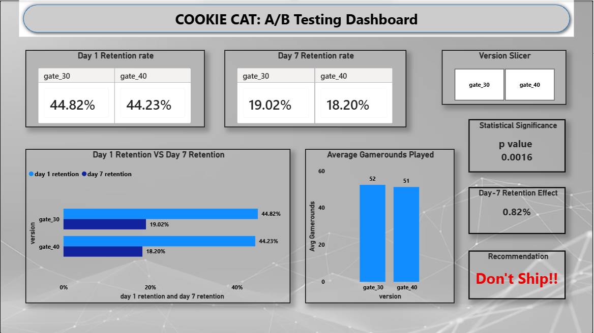

# Cookie Cats A/B Test: Should the Level Gate Move to 40?

## The problem

Cookie Cats is a mobile puzzle game with a "gate" — basically a forced pause — that used to sit at level 30. Hit the gate, and you either wait it out or use extra resources to skip through. The studio wanted to test something: what if we push that gate back to level 40 instead? The idea was that a later gate might keep people playing longer before they hit the first real wall.

But that's a bet with two sides. Delay the gate too long and you might just lose people to boredom before they ever get there. So instead of guessing, they ran an actual A/B test — and this project is my analysis of that data, working through it the way I'd want to defend it in an interview: real numbers, a real statistical test, and a call I can actually justify.

## My hypothesis

Before touching the data, I laid out what I was actually testing:

- **H0:** Moving the gate to level 40 has no effect on Day-7 retention.
- **H1:** Moving the gate to level 40 changes Day-7 retention.
- **Primary metric:** Day-7 retention. I checked Day-1 too, but mostly as a sanity check — nobody reaches level 30 or 40 within their first single day of playing, so a big Day-1 gap between groups would mean something's wrong with the experiment setup itself, not the gate.

## How I approached it

1. **Data:** ~90,189 players, randomly split into gate_30 (control) and gate_40 (treatment), loaded into BigQuery.
2. **SQL:** Pulled retention rates and raw returner counts per group — see `sql/`.
3. **Stats:** Ran a two-proportion z-test on Day-7 retention to check if the gap was real or just noise — see `python/ab_test_analysis.ipynb`.
4. **Beyond the p-value:** Calculated a 95% confidence interval too, because "statistically significant" doesn't automatically mean "big enough to matter." Wanted the actual size of the effect, not just a yes/no.
5. **Dashboard:** Built in Power BI on top of the aggregated BigQuery output — see `dashboard/`.
6. **Memo:** Instead of writing the business summary myself, I automated it — a script that feeds the real results into the Gemini API and generates the memo. Script's in `python/generate_memo.py`, output in `memo/business_memo.md`.

## What I found

| Metric | gate_30 (control) | gate_40 (treatment) |
|---|---|---|
| Total players | 44,700 | 45,489 |
| Day-1 retention | 44.82% | 44.23% |
| Day-7 retention | 19.02% | 18.20% |
| Avg. game rounds played | 52 | 51 |

Day-1 numbers are close enough that I'm calling the experiment setup balanced — good, that's what you want before trusting Day-7.

Day-7 is where it gets interesting: gate_40 came in at 18.20% vs. 19.02% for gate_30. Eyeballing it, that's a small gap. But eyeballing isn't a real answer, so I ran the numbers:

- **z = 3.16, p = 0.0016** — well under the usual 0.05 cutoff, so this isn't random noise.
- **95% CI: [0.31, 1.33] percentage points** — and it never crosses zero, meaning there's no version of this data where gate_40 comes out neutral or better.
- **Engagement stayed flat** (52 vs. 51 rounds played on average), so this isn't players getting bored and quitting mid-session — it's specifically a return-rate problem.

## My recommendation

**Don't ship the gate_40 change. Keep the gate at level 30.**

The effect is real, it's consistently negative across the whole confidence interval, and there's no engagement upside to offset it. About a 4.3% relative decline in Day-7 retention isn't huge, but at any real scale — hundreds of thousands of installs — that adds up to a lot of players who don't come back.

One caveat worth flagging: this dataset doesn't include in-app purchase data. If moving the gate changes *when* people spend money, that's a separate question worth a follow-up analysis. But on retention alone, the case against shipping this is solid enough to act on.

## Tools used

- **SQL / Google BigQuery** — querying and aggregating the raw data
- **Python (statsmodels)** — the z-test and confidence interval
- **Power BI** — the dashboard
- **Gemini API** — automated memo generation
- **Git/GitHub** — version control

  
